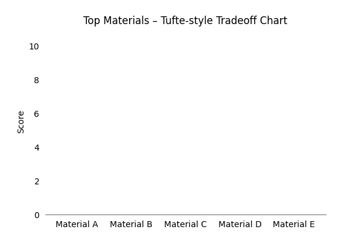

<!-- 🌲 Grove Project Header: Banners + Badges -->

<p align="center">
  
</p>

<!-- 🌿 Tufte-style Tradeoff Chart -->
<p align="center">
  
</p>
<p align="center">
  <video src="assets/tufte_tradeoff_chart.mp4" controls 
         style="width:80%; max-width:850px; height:auto;"></video>
</p>

<!-- 🌟 Future Rothko-style / Sora Demo Placeholder -->
<p align="center">
  
</p>
<p align="center">
  <video src="assets/placeholder_rothko_demo.mp4" controls 
         style="width:80%; max-width:850px; height:auto;"></video>
</p>

<br><br>

<!-- 🏷️ Grove Project Badges - Color Coordinated & Responsive -->
<div align="center" style="display: flex; flex-wrap: wrap; justify-content: center; gap: 5px;">

  <!-- Core project badges -->
  <a href="./">
    
  </a>
  <a href="./">
    
  </a>
  <a href="./LICENSE">
    
  </a>

  <span style="flex-basis: 100%; height: 4px;"></span>

  <!-- AI-related badges -->
  <a href="./sora-demo">
    
  </a>
  <a href="./sora-demo">
    
  </a>
  <a href="./sora-demo">
    
  </a>

  <span style="flex-basis: 100%; height: 4px;"></span>

  <!-- Phase & Guardrails badges -->
  <a href="./">
    
  </a>
  <a href="./">
    
  </a>

  <!-- Optional Lab Verified badge -->
  <a href="./verification.md">
    
  </a>

  <span style="flex-basis: 100%; height: 4px;"></span>

  <!-- JS/CSS/Python/Jupyter badges -->
<a href="https://intelligentiaomni.github.io/holiday-demo/">
  
</a>
<a href="https://intelligentiaomni.github.io/holiday-demo/">
  
</a>
<a href="assets/tufte_tradeoff_chart.mp4">
  
</a>
<a href="assets/tufte_tradeoff_chart.mp4">
  
</a>

<span style="flex-basis: 100%; height: 4px;"></span>


  <!-- Demo / Fundraiser badges -->
  <a href="https://intelligentiaomni.github.io/holiday-demo/">
    
  </a>
  <a href="https://intelligentiaomni.github.io/holiday-demo/">
    
  </a>
  <a href="https://intelligentiaomni.github.io/holiday-demo/">
    
  </a>

</div>
<br>

---

[🌐 **New! Physical Intelligence Preview**](./grove-ai-dev/experiments/physical-intelligence-preview.html)

---

#### Grove Project Lab Notebook

[](https://colab.research.google.com/github/intelligentiaomni/grove-prototype/blob/main/notebooks/YourNotebook.ipynb)

| 🧮 **Jupyter NBViewer** | [Open in NBViewer](https://nbviewer.org/github/intelligentiaomni/grove-project/blob/main/grove_lab_notebook.ipynb)                                                                        |
| ☁️ **Google Colab**     | [](https://colab.research.google.com/github/intelligentiaomni/grove-project/blob/main/grove_lab_notebook.ipynb) |
| 🧠 **Repository**       | [View on GitHub](https://github.com/intelligentiaomni/grove-project/blob/main/grove_lab_notebook.ipynb)                                                                                   |

---

#### Hybrid Lab Holiday Fundraiser & Giveaway

**[🎁 Visit the Holiday Demo](https://intelligentiaomni.github.io/holiday-demo/)** 
 
[](https://patreon.com/intelligentiaomni)

---

### Grove Physical Intelligence 

**Physical → Digital Twin → Cognitive → Community**

- 🦾 **Physical Layer:** Robots move real-world materials and prototypes.  
- 🧩 **Digital Twin:** Each object indexed and mirrored in Grove’s spatial map.  
- 🧠 **Cognitive Layer:** AI coordinates motion, flow, and reasoning.  
- 🧱 **Community Layer:** Builders co-create intelligent workflows together.

> *A Grove Project lab experiment in embodied autonomy — exploring how physical intelligence can help early researchers move knowledge, materials, and prototypes with agency, confidence, and indexed creation.*

[](./research/physical-intelligence-abstract.md)
[](./grove-ai-dev/experiments/physical-intelligence.md)
[](./research/phys_intelligence_poster.png)

---

# 🌲 Grove Project

**The future of intelligence — An evolving ecosystem for AI-assisted discovery, learning, and collaboration.**
 
Building toward **planetary intelligence** as a civilizational and economic foundation. We explore deep learning, intelligent systems, and cross-disciplinary collaboration.  
Our focus: **AI-augmented scientific discovery tools** that advance sustainable research, responsible innovation, and long-term prosperity aligned with human values and shared global benefit.

---

## 🔭 Vision Layers

The **Grove Project** unifies AI module to leverage scientific discovery.

| Layer | Focus |
|-------|--------|
| Scientific | Materials discovery, energy systems, climate-resilient infrastructure |
| Economic | Building open innovation and sustainable growth |
| Civilizational | Aligning planetary intelligence with human values |
| Cognitive | AI reasoning, multi-step synthesis, continuous discovery |

---

## ⚙ Core Components

- **Grove AI Dev** orchestration layer integrating GPT, Codex, DALL-E, Sora, Guardrails, and observability tools.  
- **Grove Sprint Logger v2** correspondence system for async sprint workflows, AI-enhanced logbook stored as structured markdown for easy versioning, async review, and integration with discovery engines.
- **Grove “Learn & Level-up” Builder Game** open-world simulation bridging coding, problem-solving, and research-based gameplay.  
- **Trade-off Visualizer** Tufte-style reasoning dashboard.  
- **Scientific Discovery** AI-augmented new energy materials discovery, properties, and systems scalable across disciplines.
- **Collaboration to foster a broader culture of purpose-driven innovation**.

---

## 🛠 TL;DR Modular Hub

Hub Functions as **Central dashboard + API** → all prototypes feed into one “front door”

Early **modules** (Phase 1) → concrete ROI, tangible results

Intermediate modules (Phase 2) → hypothesis generation, **multi-modal reasoning**

**Long-term modules** (Phase 3) → meta-level prioritization, cognitive modeling

---

## 💡 AI New energy materials discovery

This prototype explores how scientists can discover new materials critical for energy applications, such as quantum superconductors, semiconductors, energy-transmission systems, solar, hydrogen, climate-resilient polymers, catalysts, and solid-state batteries, using multi-agent AI models and physics-informed reasoning, hypothesis development, structured experiments, and lab automation, **bridging computational insight with experimental potential**. 

**Goal**

To help researchers rapidly identify top candidate materials in energy systems to ensure improved infrastructure. 

**Why** 

- **Concrete, high-impact domain with vast datasets and clear real-world stakes**
- **Relatively developed experimental data and pipelines to integrate AI tools**
- **Potential breakthroughs** → improved systems, safer, efficient, resilient infrastructure adaptive to changing, uncertain conditions, less costs etc. 
- **This is a step toward scientific research co-pilots for next-gen cross-disciplinary lab**
- **The broader aim is to enable scientific discovery in materials and systems integral to quantum infrastructure, superconductors and semiconductors**.

“By combining deep reasoning and specialist agents, dynamic AI lab partners, and insight engines, we nurture early minds to become autonomous researchers equipped with critical thinking skills rooted in evidence.”

**Example Use Case**

Input constraints → conductivity, stability, cost →  
AI returns top candidate materials with reasoning and trade-off plots.

---

### **🎮 Grove Learn & Level Up Game**

“Should’ve gone to Codeforces Gym”

* **Personalized learning paths**: AI can suggest exercises, challenges, or “gyms” based on user skill and progress.
* **Adaptive difficulty**: Dynamically adjust levels to keep users engaged.
* **Intelligent hints / feedback**: Explain why a solution works or where mistakes occur.
* **Pattern recognition**: Spot recurring gaps in knowledge across users and propose mini-challenges.

---

### **🤝 Reconnect Authenticator**

* **Smart contact suggestions**: AI can identify who to reconnect with based on activity, network overlap, or prior interactions.
* **Fraud / authenticity detection**: Flag suspicious requests before the user approves.
* **Context-aware instructions**: Tailor next-step guidance for each recipient.
* **Automated reconciliation**: Sync scattered identities across platforms intelligently.

---

### **📡 V2 Sprint Logger**

* **Automated logging & summaries**: AI can interpret updates from code commits, messages, or meetings and log them.
* **Predictive sprint insights**: Forecast blockers, estimate completion times, or suggest re-prioritization.
* **Pattern detection**: Highlight recurring issues or successful patterns across sprints.
* **Intelligent notifications**: Only alert the right people with relevant updates.

---

## 📓 Logbook

> One thing realized while building this, **the correspondence layer Sprint Logger for transmission is itself a prototype.**  
> Why? Transmitting insight, testing resonance, framing experiments, and attracting collaborators, also applicable outside lab.

---

## **🚋 Tracking Plan**

Serves as a **single source of truth** for analytics, monitoring, and iteration, supporting:

* Production decision-making
* User behavior analysis
* Prototype and feature validation
* Cross-concept insights for AI-enhanced features

---

## 🌐 Planetary & Economic Layer

Long-term development connects discovery modules to simulated economic and civilizational systems. This layer models how distributed research ecosystems and aligned AI agents might coordinate innovation, infrastructure, and sustainable research.

---

## 🧱 Contributing

This is early-stage and exploratory. Ideas, feedback, or collaboration → open an issue or PR.

---

### 🌐 Grove Project — Explore, Support, Listen

[](https://intelligentiaomni.github.io/grove-project)
[](https://github.com/intelligentiaomni)
[](https://patreon.com/intelligentiaomni)
[](https://bit.ly/433t1B6)

---

## 🌳 Repository Structure
```
grove-project/
├─ README.md                         # Project overview (with badges + roadmap anchors)
├─ index.md                          # Homepage content
├─ about.md                          # About IO Lab & Grove vision
├─ research.md                       # Research questions, context
├─ simulations.md                    # Interactive and AI foresight prototypes
│
├─ src/                              # Production modules
│   ├─ prompt_engine/
│   ├─ visualizer/
│   └─ utils/
│
├─ prototypes/                       # Experimental builds and mini-projects
│   ├─ grove-prototype/
│   ├─ early-christmas-lottery/
│   └─ sprint-logger-v2/
│
├─ grove-ai-dev/                     # 🧠 NEW: Core AI Development layer
│   ├─ README.md                     # Local readme with banner + badges
│   ├─ assets/
│   │   ├─ banner.svg
│   │   └─ badges/
│   │        ├─ badge-ai.svg
│   │        ├─ badge-prototype.svg
│   │        ├─ badge-beta.svg
│   │        └─ badge-experimental.svg
│   ├─ architecture/
│   │   ├─ grove-ai-architecture.md
│   │   └─ module-interface-specs.md
│   ├─ integrations/
│   │   ├─ sprintlogger-bridge.md
│   │   ├─ builder-game-integration.md
│   │   └─ discovery-tools-sync.md
│   ├─ experiments/
│   │   ├─ 2025-10-13-agent-shells-simulation.md
│   │   └─ 2025-10-13-tradeoff-visualizer-ai.md
│   └─ roadmap.md
│
├─ grove-sprint-logger/
│   └─ logs.md
│
├─ backend-ai/
│   ├─ index.js
│   ├─ tasksProcessor.js
│   └─ utils.js
│
├─ concepts/
│   ├─ grove-builder-game/
│   └─ reconnect-authenticator/
│
├─ assets/
│   ├─ demos/
│   ├─ diagrams/
│   ├─ idea-thumbnails/
│   └─ css/
│
├─ docs/
│   ├─ roadmap.md                    # Master roadmap linking to module sub-roadmaps
│   ├─ tracking-plan.md
│   ├─ styleguides/
│   └─ archive/
│
└─ scripts/
    └─ generate-log.js

```